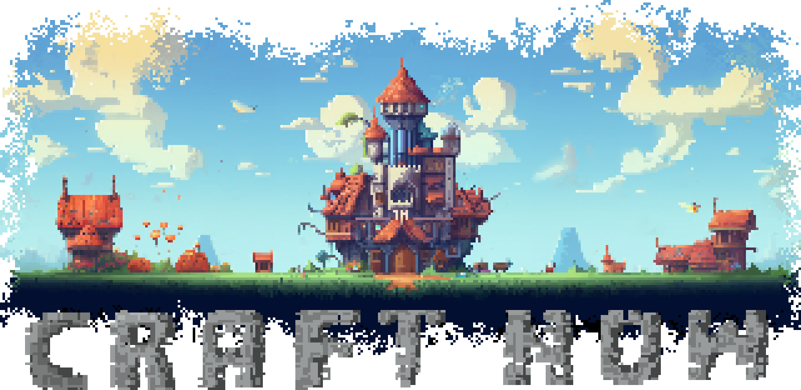

  
  <h1 align="center" style="margin: 0 auto 0 auto;">CraftNow</h1>

 

  
  
  
  

CraftNow 是一个游戏引擎，基于C++和OpenGL，使用GLSL着色器语言，并计划支持Vulcan等其他渲染API。
受到 [Cherno](https://github.com/TheCherno) 的启发，为了学习C++和大型项目开发的流程经验。我选择启动一个相对较为复杂的“软件”项目，而不是一个简单的“游戏”，
因为游戏引擎的复杂程度远高于游戏，意在实际的开发中学习更实践的知识积累经验。

## 目录

- [目录](#目录)
- [计划](#计划)
- [开始](#开始)
  - [克隆](#克隆)
- [许可](#许可)

## 计划

- [x] 入口程序
- [x] 应用程序层
- [x] Debugging支持
- [x] 窗口层
    - [x] 事件系统
    - [x] 信号输入系统
- [ ] 渲染系统
    - [ ] 2D渲染器
        - [x] 场景图像
        - [x] 渲染层
        - [ ] 动画
        - [x] 相机
        - [ ] 后处理效果
    - [ ] 3D渲染器
- [x] 渲染API abstract（用于支持多个渲染API 例如DirectX, Vulcan）
    - [x] OpenGL
    - [ ] Vulcan
    - [ ] DirectX
- [x] 实体组件系统
- [ ] 文件系统
- [ ] 物理引擎
- [ ] 资产构建系统
- [ ] 内存系统
- [ ] 内置脚本语言
- [ ] 热插拔系统（实时更新资产的变化)

## 开始

### 克隆
本项目使用`premake`管理依赖，所以务必继承多个依赖仓库。  
使用`Git`克隆到本地 `git clone --recursive https://github.com/YINGHAIDADA/CraftNow`.  
如果第一次没有使用继承克隆, 用 `git submodule update --init` 来克隆必须的组件

## 许可

